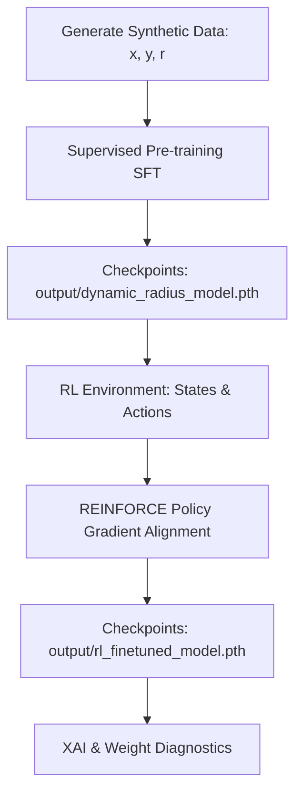

# Dynamic 2D Circle Classifier: Supervised Pre-training (SFT) & Reinforcement Learning Alignment


A high-performance, modular Deep Learning repository showcasing **Supervised Pre-training**, **Reinforcement Learning (RL) Fine-Tuning (Alignment)**, **Explainable AI (XAI)**, and **Neural Diagnostics** in PyTorch.


---

## 📖 Table of Contents
- [Mathematical Formulation](#-mathematical-formulation)
- [System Architecture & Training Pipeline](#-system-architecture--training-pipeline)
  - [1. Supervised Fine-Tuning (SFT)](#1-supervised-fine-tuning-sft)
  - [2. Reinforcement Learning (RL) Alignment](#2-reinforcement-learning-rl-alignment)
- [Model Design & Capacity Optimization](#-model-design--capacity-optimization)
- [Explainable AI (XAI) via Integrated Gradients](#-explainable-ai-xai-via-integrated-gradients)
- [📂 Project Structure](#-project-structure)
- [🚀 Execution Guide](#-execution-guide)
- [📊 Visual Diagnostics & Plots](#-visual-diagnostics--plots)

---

## 📐 Mathematical Formulation

The core objective is to classify whether a random 2D point $\mathbf{x} = (x_1, x_2)$ lies inside or outside a circular boundary parameterized by a dynamic radius $r$. 

$$\text{Target } y = \begin{cases} 1 & \text{if } \sqrt{x_1^2 + x_2^2} \le r \\ 0 & \text{otherwise} \end{cases}$$

Unlike typical classification models that learn a *static* decision boundary (where $r$ is constant and hardcoded in the labels), this model accepts **both** the coordinate features and the radius feature as inputs:
$$\mathbf{X} = [x_1, x_2, r]^T \in \mathbb{R}^3$$
This forces the neural network to approximate the non-linear relationship between coordinates and the boundary radius.

---

## ⚙️ System Architecture & Training Pipeline

The project follows a hybrid paradigm similar to modern AI alignment pipelines:



### 1. Supervised Fine-Tuning (SFT)
* **Dataset Generation**: We generate $6,000$ points where coordinates $x_1, x_2$ are sampled uniformly from $[-3.0, 3.0]$ and the radius $r$ is sampled from $[0.3, 3.0]$.
* **Optimization**: Binary Cross Entropy Loss (BCELoss) combined with the Adam optimizer ($lr=0.02$).
* **Overfitting Prevention**: Custom **Early Stopping** tracks validation loss. If it fails to improve for `patience=25` epochs, training is halted, and the best model weights are restored.
* **Result**: Achieves **~98.5% Accuracy** on unseen validation datasets.

### 2. Reinforcement Learning (RL) Alignment
Instead of relying on supervised gradients, we treat the pre-trained classifier as a stochastic policy $\pi_\theta(a|\mathbf{s})$ and optimize it via policy gradients over an expanded domain of $[-15.0, 15.0]$.
* **Gymnasium Environment**: We wrapped the training domain in a custom `CircleEnv` inheriting from `gymnasium.Env`.
* **State Space ($\mathcal{S}$)**: $\mathbf{s} = [x_1, x_2, r] \in [-15.0, 15.0]^2 \times [0.5, 15.0]$
* **Action Space ($\mathcal{A}$)**: Binary prediction $a \in \{0, 1\}$ (0 for OUTSIDE, 1 for INSIDE).
* **Policy ($\pi_\theta$)**: The model's Sigmoid output probability $p$ forms a Bernoulli distribution.
* **Shaped Reward Function ($\mathcal{R}$)**:
  Instead of static feedback, we use a continuous, distance-based penalty to help the agent learn boundary precision:

$$\mathcal{R}(\mathbf{s}, a) = \begin{cases} +1.0 & \text{if prediction } a \text{ is correct} \\ -(0.5 + 0.2 \times |d - r|) & \text{if prediction } a \text{ is incorrect (shaped penalty)} \end{cases}$$

  where $d = \sqrt{x_1^2 + x_2^2}$ is the distance to the origin and $r$ is the dynamic boundary radius.
* **REINFORCE Algorithm**: We update the policy parameters using the policy gradient loss:

$$\mathcal{L}_{PG}(\theta) = -\log \pi_\theta(a|\mathbf{s}) \times \mathcal{R}(\mathbf{s}, a)$$

* **Warm Start & Convergence**: Starting from SFT weights prevents the RL agent from starting from zero-knowledge. Lowering the learning rate to $lr=0.001$ protects the pre-trained weights from collapsing (**Catastrophic Forgetting**), resulting in a stable reward convergence of **+0.993** (where 1.0 is perfect).


---

## 🧠 Model Design & Capacity Optimization

* **Initial Capacity Issues**: A simple model with only 4 hidden neurons (`Linear(3, 4) -> ReLU() -> Linear(4, 1)`) underfitted the complex geometric space when expanded to $[-15.0, 15.0]$, failing to maintain boundary precision during RL.
* **Final Architecture**: We expanded the capacity to 673 parameters using a deep MLP:
  ```
  Input Features (3) -> Linear(3, 32) -> ReLU() -> Linear(32, 16) -> ReLU() -> Linear(16, 1) -> Sigmoid()
  ```
  This higher capacity allows the network to generalize stably across vast coordinates and boundaries.

---

## 🔍 Explainable AI (XAI) via Integrated Gradients

To verify that the model is making decisions based on mathematical relationships rather than correlation artifacts, we implement **Integrated Gradients (IG)**.

Integrated Gradients computes the path integral of gradients along a straight line from a baseline (all-zero state $\mathbf{x}'$) to the input $\mathbf{x}$:

$$\text{IG}_i(x) = (x_i - x'_i) \times \int_{0}^{1} \frac{\partial F(x' + \alpha(x - x'))}{\partial x_i} d\alpha$$

### Attribution Results:
For an input point $(0.4, 0.4)$ with radius $r=0.7$ (Distance $= 0.5657$):
* **Input R (Radius)**: Positive attribution (**+3.5773**) $\implies$ Supports predicting **INSIDE** (as radius increases, the circle covers the point).
* **Input X / Y**: Negative attributions (**-1.5806 / -1.2232**) $\implies$ Support predicting **OUTSIDE** (as coordinates increase, the point moves away from origin).

This exactly mimics the mathematical gradient of the circle formula, verifying alignment!

---

## 📂 Project Structure

* [model/base_model.py](model/base_model.py): Core neural network definition.
* [config/train_config.yaml](config/train_config.yaml): Centralized configuration for supervised and RL parameters.
* [train.py](train.py): Reusable supervised trainer containing Early Stopping.
* [main.py](main.py): Pipeline script generating data, launching supervised training, and outputting decision boundary plots.
* [rl/rl_finetune.py](rl/rl_finetune.py): RL training script using REINFORCE.
* [evaluate/evaluate.py](evaluate/evaluate.py): Fast evaluation script for testing custom points.
* [evaluate/plot_stats.py](evaluate/plot_stats.py): Distribution plotter for weights and biases.
* [evaluate/compare_weights.py](evaluate/compare_weights.py): Metric-based weight drift comparator (Supervised vs. RL).
* [evaluate/xai_explain.py](evaluate/xai_explain.py): Integrated Gradients calculation and plot.

---

## 🚀 Execution Guide

Make sure dependencies are installed:
```bash
pip install torch numpy matplotlib pyyaml
```

### 1. Centralized Configuration
Modify training hyperparameters inside [config/train_config.yaml](config/train_config.yaml).

### 2. Run Supervised Learning
Runs dataset generation, trains the baseline classifier with Early Stopping, and outputs boundaries:
```bash
python main.py
```

### 3. Run Reinforcement Learning Alignment
Fine-tunes the supervised model in a dynamic reward environment over a larger range $[-15.0, 15.0]$:
```bash
python rl/rl_finetune.py
```

### 4. Interactive Point Testing
Modify custom points `X_COORDINATE`, `Y_COORDINATE`, and `RADIUS` at the bottom of [evaluate/evaluate.py](evaluate/evaluate.py) and execute:
```bash
python evaluate/evaluate.py
```

### 5. Diagnostics & Interpretability
Check weight statistics and parameter drift:
```bash
python evaluate/plot_stats.py
python evaluate/compare_weights.py
```
Generate local and global XAI explanations:
```bash
python evaluate/xai_explain.py
```

---

## 📊 Visual Diagnostics & Plots

All generated visualizations are saved in the [evaluate/plots/](evaluate/plots) directory:

1. **`multi_radius_decision_boundary.png`**: Plots the learned boundary (green) against the true mathematical circle (dashed black line) for $r = 0.5, 1.5, 2.5$.
2. **`rl_training_rewards.png`**: Displays the training reward curve showing fast, stable convergence due to supervised warm start.
3. **`xai_explanation.png`**: Attribution bar chart proving local and global sensitivity parameters.
4. **`weight_comparison.png`**: Histograms comparing the distribution shift of neural weights and biases between Supervised and RL training phases.
5. **`model_weight_stats.png`**: Layer-by-layer parameter weight distribution.

---

## 📄 License

This project is licensed under the MIT License - see the [LICENSE](LICENSE) file for details.

